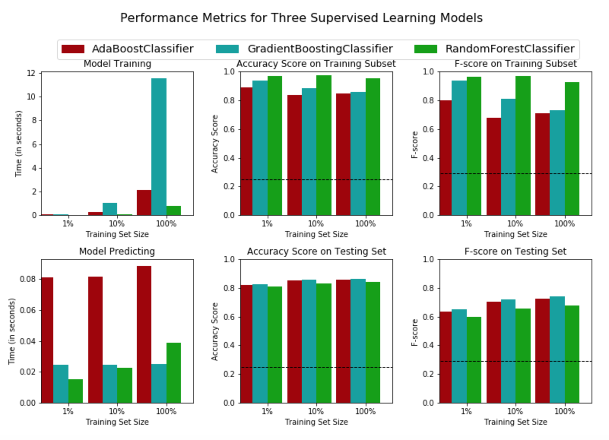

# Data Scientist Nanodegree
# Supervised Learning
## Project: Finding Donors for CharityML


## Results



This chart compares three machine learning models: AdaBoost, Gradient Boosting, and Random Forest. The models were tested on different training set sizes (1%, 10%, and 100%) to see how well they perform in terms of training time, prediction time, accuracy, and F-score.

### Training and Prediction Time
Gradient Boosting takes the longest to train, especially when using 100% of the data. In contrast, Random Forest and AdaBoost train much faster. However, when it comes to making predictions, AdaBoost is the slowest, while Random Forest is the fastest.

### Accuracy and F-score
On the training data, Gradient Boosting and Random Forest achieve the highest accuracy, while AdaBoost is slightly behind. However, when tested on new (unseen) data, all three models perform similarly well, showing high accuracy.

F-score, which measures the balance between precision and recall, follows a similar pattern. Gradient Boosting and Random Forest score higher on the training set, while all models perform almost equally well on the testing set.

### Analysis

Random Forest is a great choice since it trains quickly and predicts quickly. However, if accuracy is the top priority, Gradient Boosting is slightly better, but it takes much longer to train. AdaBoost is a decent option but is slower in making predictions.

## Install

This project requires **Python 3.x** and the following Python libraries installed:

- [NumPy](http://www.numpy.org/)
- [Pandas](http://pandas.pydata.org)
- [matplotlib](http://matplotlib.org/)
- [scikit-learn](http://scikit-learn.org/stable/)

You will also need to have software installed to run and execute an [iPython Notebook](http://ipython.org/notebook.html)

## Run

In a terminal or command window, navigate to the top-level project directory `finding_donors/` (that contains this README) and run one of the following commands:

```bash
ipython notebook finding_donors.ipynb
```  
or
```bash
jupyter notebook finding_donors.ipynb
```

This will open the iPython Notebook software and project file in your browser.

## Data

The modified census dataset consists of approximately 32,000 data points, with each datapoint having 13 features. This dataset is a modified version of the dataset published in the paper *"Scaling Up the Accuracy of Naive-Bayes Classifiers: a Decision-Tree Hybrid",* by Ron Kohavi. You may find this paper [online](https://www.aaai.org/Papers/KDD/1996/KDD96-033.pdf), with the original dataset hosted on [UCI](https://archive.ics.uci.edu/ml/datasets/Census+Income).

**Features**
- `age`: Age
- `workclass`: Working Class (Private, Self-emp-not-inc, Self-emp-inc, Federal-gov, Local-gov, State-gov, Without-pay, Never-worked)
- `education_level`: Level of Education (Bachelors, Some-college, 11th, HS-grad, Prof-school, Assoc-acdm, Assoc-voc, 9th, 7th-8th, 12th, Masters, 1st-4th, 10th, Doctorate, 5th-6th, Preschool)
- `education-num`: Number of educational years completed
- `marital-status`: Marital status (Married-civ-spouse, Divorced, Never-married, Separated, Widowed, Married-spouse-absent, Married-AF-spouse)
- `occupation`: Work Occupation (Tech-support, Craft-repair, Other-service, Sales, Exec-managerial, Prof-specialty, Handlers-cleaners, Machine-op-inspct, Adm-clerical, Farming-fishing, Transport-moving, Priv-house-serv, Protective-serv, Armed-Forces)
- `relationship`: Relationship Status (Wife, Own-child, Husband, Not-in-family, Other-relative, Unmarried)
- `race`: Race (White, Asian-Pac-Islander, Amer-Indian-Eskimo, Other, Black)
- `sex`: Sex (Female, Male)
- `capital-gain`: Monetary Capital Gains
- `capital-loss`: Monetary Capital Losses
- `hours-per-week`: Average Hours Per Week Worked
- `native-country`: Native Country (United-States, Cambodia, England, Puerto-Rico, Canada, Germany, Outlying-US(Guam-USVI-etc), India, Japan, Greece, South, China, Cuba, Iran, Honduras, Philippines, Italy, Poland, Jamaica, Vietnam, Mexico, Portugal, Ireland, France, Dominican-Republic, Laos, Ecuador, Taiwan, Haiti, Columbia, Hungary, Guatemala, Nicaragua, Scotland, Thailand, Yugoslavia, El-Salvador, Trinadad&Tobago, Peru, Hong, Holand-Netherlands)

**Target Variable**
- `income`: Income Class (<=50K, >50K)
